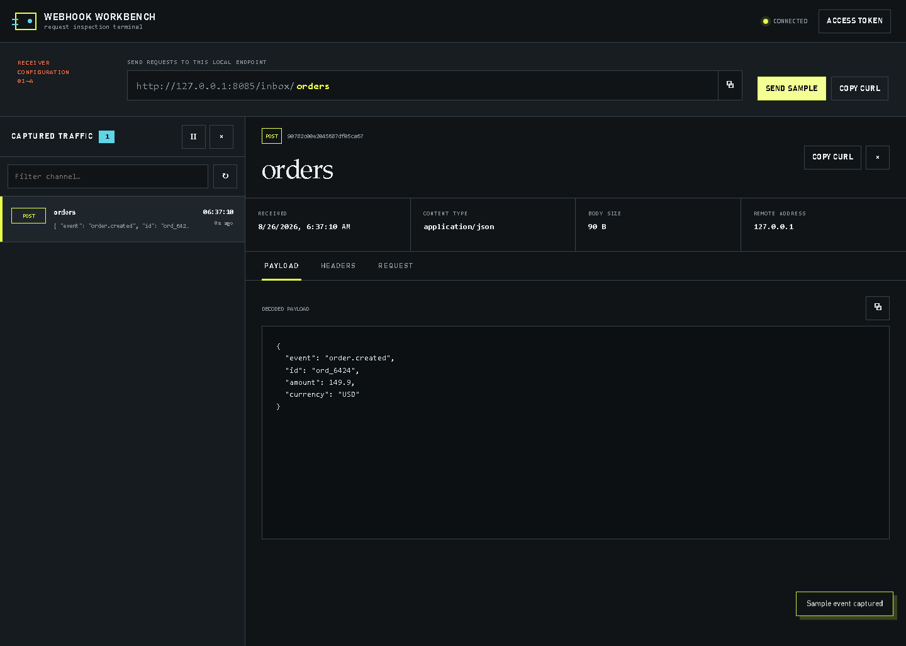
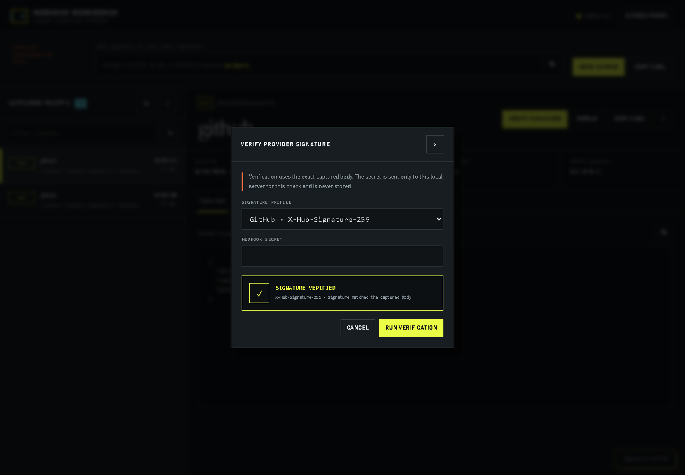

# Webhook Workbench

[](https://github.com/kyan9400/webhook-workbench/actions/workflows/ci.yml)
[](https://github.com/kyan9400/webhook-workbench/releases/latest)
[](LICENSE)

A private, self-hosted workbench for capturing and inspecting webhook requests. It ships as one dependency-free Go binary with the browser interface embedded inside it.



## What it does

- captures any HTTP method at `/inbox/{channel}`;
- shows live request traffic, decoded payloads, redacted headers, and reproducible cURL commands;
- verifies GitHub, Stripe, and generic HMAC-SHA-256 signatures against the exact captured body;
- safely replays captured requests to a chosen HTTP endpoint and previews the response;
- persists a bounded event history to a local JSON snapshot;
- redacts authorization, cookie, API key, and auth-token headers before storage;
- supports optional constant-time bearer-token authentication;
- limits captured body size and marks truncated requests;
- preserves binary bodies as base64 rather than corrupting them;
- exposes `/healthz` for container and process supervision.

The default listener is `127.0.0.1:8080`. Nothing is exposed to the network unless you choose a different bind address.

## Quick start

Download a binary from [Releases](https://github.com/kyan9400/webhook-workbench/releases/latest), then run:

```bash
webhook-workbench
```

Open `http://127.0.0.1:8080`, choose a channel, and send a request:

```bash
curl -X POST http://127.0.0.1:8080/inbox/orders \
  -H 'Content-Type: application/json' \
  -d '{"event":"order.created","id":"ord_2048"}'
```

Or start the hardened local container:

```bash
docker compose up --build -d
docker compose ps
curl -f http://127.0.0.1:8080/healthz
```

The Compose service runs as UID 10001, drops Linux capabilities, uses a read-only root filesystem, limits CPU and memory, and persists only `/app/data`.

## Authentication

Set a bearer token before binding outside localhost:

```bash
export WEBHOOK_WORKBENCH_TOKEN='replace-with-a-long-random-value'
webhook-workbench --listen 0.0.0.0:8080
```

Webhook senders must include `Authorization: Bearer …`. Enter the same value through **Access token** in the UI; it is held in `sessionStorage` and disappears when the tab closes.

If traffic crosses a network, put the service behind a TLS-terminating reverse proxy. The built-in token is access control, not transport encryption.

## Configuration

| Flag | Environment variable | Default | Purpose |
|---|---|---:|---|
| `--listen` | `WEBHOOK_WORKBENCH_LISTEN` | `127.0.0.1:8080` | HTTP bind address |
| `--data` | `WEBHOOK_WORKBENCH_DATA` | `data/events.json` | Persistence path; empty means memory-only |
| `--token` | `WEBHOOK_WORKBENCH_TOKEN` | empty | Bearer token for inbox and API routes |
| `--retention` | `WEBHOOK_WORKBENCH_RETENTION` | `200` | Maximum retained events |
| `--max-body` | `WEBHOOK_WORKBENCH_MAX_BODY` | `1048576` | Maximum stored body bytes |
| `--allow-private-replay` | `WEBHOOK_WORKBENCH_ALLOW_PRIVATE_REPLAY` | `false` | Permit replay to private and local network addresses |

Flags take precedence over environment defaults. `--version` prints build metadata.

Replay is conservative by default: private, loopback, link-local, and non-HTTP targets are rejected. DNS is checked again when the connection is opened, redirects are limited, proxy environment variables are ignored, and authorization, cookie, forwarding, and hop-by-hop headers are stripped. Private-network replay is available only through the explicit opt-in above.

## Signature verification

Select a captured request and choose **Verify signature**. The workbench supports:

| Profile | Captured header | Signed payload |
| --- | --- | --- |
| GitHub | `X-Hub-Signature-256` | Raw body with HMAC-SHA-256 |
| Stripe | `Stripe-Signature` | Timestamp, period, and raw body with a five-minute receipt window |
| Generic | Configurable | Raw body with an optional digest prefix |

The secret is used for one verification request and is never written to disk or browser storage. Provider signature headers remain in the local event snapshot so they can be checked, but they are stripped from replayed requests. Truncated captures cannot be verified because they no longer contain the exact provider payload.



## API

| Method | Route | Description |
|---|---|---|
| `ANY` | `/inbox/{channel}` | Capture a request |
| `GET` | `/api/events?channel=` | List event summaries |
| `GET` | `/api/events/{id}` | Read an event |
| `POST` | `/api/events/{id}/replay` | Replay an event to `{"targetUrl":"https://…"}` |
| `POST` | `/api/events/{id}/verify` | Verify a provider signature with an ephemeral secret |
| `DELETE` | `/api/events/{id}` | Delete an event |
| `DELETE` | `/api/events` | Clear all events |
| `GET` | `/api/config` | Read non-sensitive UI configuration |
| `GET` | `/healthz` | Health probe |

When authentication is configured, all inbox and event routes require the bearer token. Health, UI, and non-sensitive configuration routes remain available to support login and supervision.

## Development

Requires Go 1.21 or later.

```bash
go test -race ./...
go vet ./...
go build ./cmd/webhook-workbench
```

The service uses only the Go standard library. Tests cover persistence, retention, defensive copying, authentication, redaction, truncation, binary bodies, validation, GitHub/Stripe/generic signature verification, event APIs, replay behavior, SSRF defenses, and security headers.

## Operations and rollback

Back up the configured JSON data file or Docker volume before changing retention or storage paths. Release binaries are immutable and include checksums.

To roll back a container deployment, pin the earlier version in `compose.yml`, then recreate and verify it:

```bash
docker compose pull
docker compose up -d --force-recreate
curl -f http://127.0.0.1:8080/healthz
```

## License

[MIT](LICENSE) © Hassan Ak
